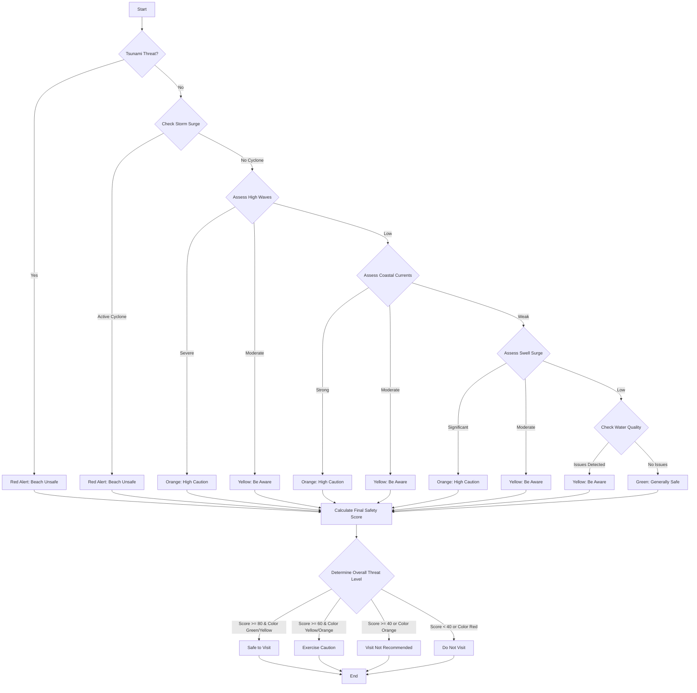

```mermaid
graph TD
    A[Start] --> B{Tsunami Threat?}
    B -->|Yes| C[Red Alert: Beach Unsafe]
    B -->|No| D{Check Storm Surge}
    D -->|Active Cyclone| E[Red Alert: Beach Unsafe]
    D -->|No Cyclone| F{Assess High Waves}
    F -->|Severe| G[Orange: High Caution]
    F -->|Moderate| H[Yellow: Be Aware]
    F -->|Low| I{Assess Coastal Currents}
    I -->|Strong| J[Orange: High Caution]
    I -->|Moderate| K[Yellow: Be Aware]
    I -->|Weak| L{Assess Swell Surge}
    L -->|Significant| M[Orange: High Caution]
    L -->|Moderate| N[Yellow: Be Aware]
    L -->|Low| O{Check Water Quality}
    O -->|Issues Detected| P[Yellow: Be Aware]
    O -->|No Issues| Q[Green: Generally Safe]
    C --> R[Calculate Final Safety Score]
    E --> R
    G --> R
    H --> R
    J --> R
    K --> R
    M --> R
    N --> R
    P --> R
    Q --> R
    R --> S{Determine Overall Threat Level}
    S -->|Score >= 80 & Color Green/Yellow| T[Safe to Visit]
    S -->|Score >= 60 & Color Yellow/Orange| U[Exercise Caution]
    S -->|Score >= 40 or Color Orange| V[Visit Not Recommended]
    S -->|Score < 40 or Color Red| W[Do Not Visit]
    T --> X[End]
    U --> X
    V --> X
    W --> X
```
