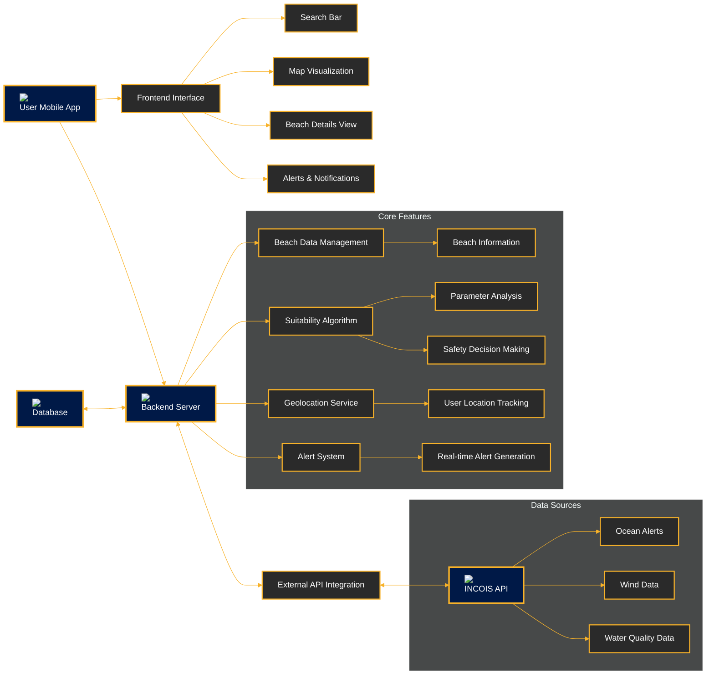

```mermaid
%%{init: {'theme': 'dark', 'themeVariables': { 'primaryColor': '#2a2a2a', 'primaryTextColor': '#fff', 'primaryBorderColor': '#7C0000', 'lineColor': '#F8B229', 'secondaryColor': '#006100', 'tertiaryColor': '#001947'}}}%%

graph LR
    A["<img src='https://storage.googleapis.com/cms-storage-bucket/0dbfcc7a59cd1cf16282.png' width='30'/> User Mobile App"] --> B[Frontend Interface]
    B --> C[Search Bar]
    B --> D[Map Visualization]
    B --> E[Beach Details View]
    B --> F[Alerts & Notifications]

    A --> G["<img src='https://www.pngitem.com/pimgs/m/159-1595977_flask-python-logo-hd-png-download.png' width='30'/> Backend Server"]
    G --> H[Beach Data Management]
    G --> I[Suitability Algorithm]
    G --> J[Geolocation Service]
    G --> K[Alert System]

    G <--> L[External API Integration]
    L <--> M["<img src='https://encrypted-tbn0.gstatic.com/images?q=tbn:ANd9GcTITmC1wTZvG7skjbgCJp3gBQ6czj_udMD5cQ&s' width='30'/> INCOIS API"]

    N["<img src='https://seekvectors.com/files/download/Firebase%20RTDB-01.png' width='30'/> Database"] <--> G

    subgraph "Data Sources"
        M --> O[Ocean Alerts]
        M --> P[Wind Data]
        M --> Q[Water Quality Data]
    end

    subgraph "Core Features"
        I --> R[Parameter Analysis]
        I --> S[Safety Decision Making]
        H --> T[Beach Information]
        J --> U[User Location Tracking]
        K --> V[Real-time Alert Generation]
    end

    classDef default fill:#2a2a2a,stroke:#F8B229,stroke-width:2px,color:#fff;
    classDef highlight fill:#001947,stroke:#F8B229,stroke-width:3px,color:#fff;
    class A,G,N,M highlight;


```
